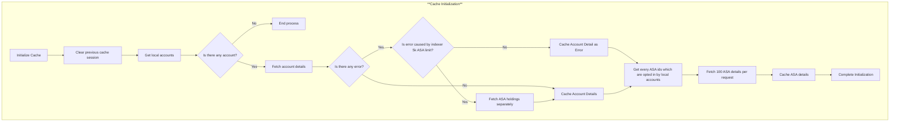
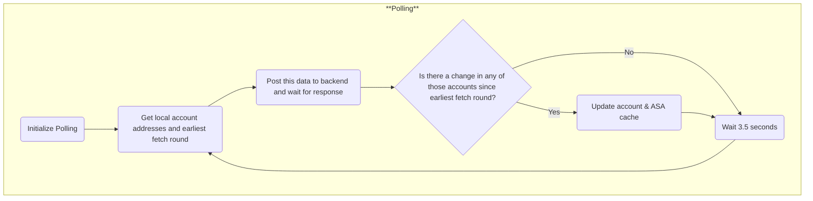
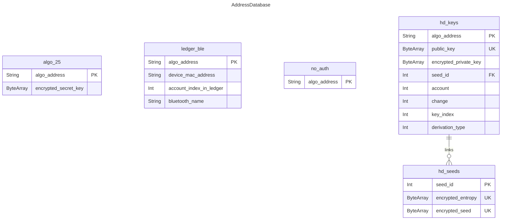
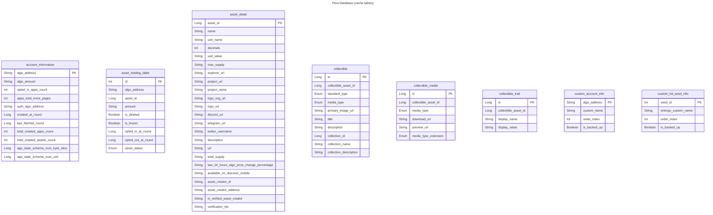

#### Common Wallet-SDK / Wallet-As-A-Service / Wallet Stack Proposed Architecture (WIP)

These diagrams are meant to be helpful and a WIP currently.  Eventually when we are ready, we will move them over to github wiki.

# App Layers

```mermaid
flowchart TD
    subgraph Pera Android App
        subgraph Native UI
            A1("App Navigation")
            A2("Notifications")
            A3("Other App Features")
        end
    A1 <--> D0
         subgraph Wallet As A Sevice
         D0("Common Modules")
            subgraph common-sdk
                D1("View Models & Repositories
            (Android Library)")
                E1("Cache")
                E2("Account")
                E3("Database")
                E4("Transaction Signing")
                E5("Encryption")
                E6("Asset/Collectibles")
                E7("Node")
                F1("Address Database")
                F2("Pera Database")
                F3("Java/Go Algo SDK")
                F4("Android Keystore")

                H1("Webview")
                H2("Deeplink")
                H3("QR Code Scanner")
                H4("Feature Flags")
                H5("Analytics")
                J1("Firebase")

                D1 <--> E1
                D1 <--> E2
                D1 <--> E3
                D1 <--> E4
                D1 <--> E5
                D1 <--> E6
                D1 <--> E7
                D1 <--> H1
                D1 <--> H2
                D1 <--> H3
                D1 <--> H4
                D1 <--> H5
                H4 <--> J1
                H5 <--> J1

                E3 <--> F1
                E3 <--> F2
                E4 <--> F3
                E2 <--> F3
                E5 <--> F4
            end
         D0 <--> D1
        end
    end

    subgraph 3rd Party Web Dapps
    C("Website")
    C <-- deeplinks into --> D0
    end

    A1 <-- embeds (Discover section) --> C

    subgraph 3rd Party Android Dapps
    G("composeTestApp")
    G <--> D0
    end

    %% colors
    %% style D1 fill:#90EE90,stroke:#f66,stroke-width:2px,color:#000000,stroke-dasharray: 5 5

    %% style E1 fill:#90EE90,stroke:#f66,stroke-width:2px,color:#000000,stroke-dasharray: 5 5
    %% style E2 fill:#90EE90,stroke:#f66,stroke-width:2px,color:#000000,stroke-dasharray: 5 5
    %% style E3 fill:#90EE90,stroke:#f66,stroke-width:2px,color:#000000,stroke-dasharray: 5 5
    %% style E4 fill:#F2D2BD,stroke:#f66,stroke-width:2px,color:#000000,stroke-dasharray: 5 5
    %% style E5 fill:#F0E68C,stroke:#f66,stroke-width:2px,color:#000000,stroke-dasharray: 5 5
    %% style E6 fill:#90EE90,stroke:#f66,stroke-width:2px,color:#000000,stroke-dasharray: 5 5
    %% style E7 fill:#F2D2BD,stroke:#f66,stroke-width:2px,color:#000000,stroke-dasharray: 5 5

    %% style H1 fill:#F2D2BD,stroke:#f66,stroke-width:2px,color:#000000,stroke-dasharray: 5 5
    %% style H2 fill:#90EE90,stroke:#f66,stroke-width:2px,color:#000000,stroke-dasharray: 5 5
    %% style H3 fill:#90EE90,stroke:#f66,stroke-width:2px,color:#000000,stroke-dasharray: 5 5
    %% style H4 fill:#90EE90,stroke:#f66,stroke-width:2px,color:#000000,stroke-dasharray: 5 5
    %% style H5 fill:#F2D2BD,stroke:#f66,stroke-width:2px,color:#000000,stroke-dasharray: 5 5

    %% style F1 fill:#90EE90,stroke:#f66,stroke-width:2px,color:#000000,stroke-dasharray: 5 5
    %% style F2 fill:#90EE90,stroke:#f66,stroke-width:2px,color:#000000,stroke-dasharray: 5 5
    %% style F3 fill:#90EE90,stroke:#f66,stroke-width:2px,color:#000000,stroke-dasharray: 5 5
    %% style F4 fill:#90EE90,stroke:#f66,stroke-width:2px,color:#000000,stroke-dasharray: 5 5
    %% style J1 fill:#90EE90,stroke:#f66,stroke-width:2px,color:#000000,stroke-dasharray: 5 5
```

# Cache Initialization

# Polling

# Algorand Address Database

# Pera Database

