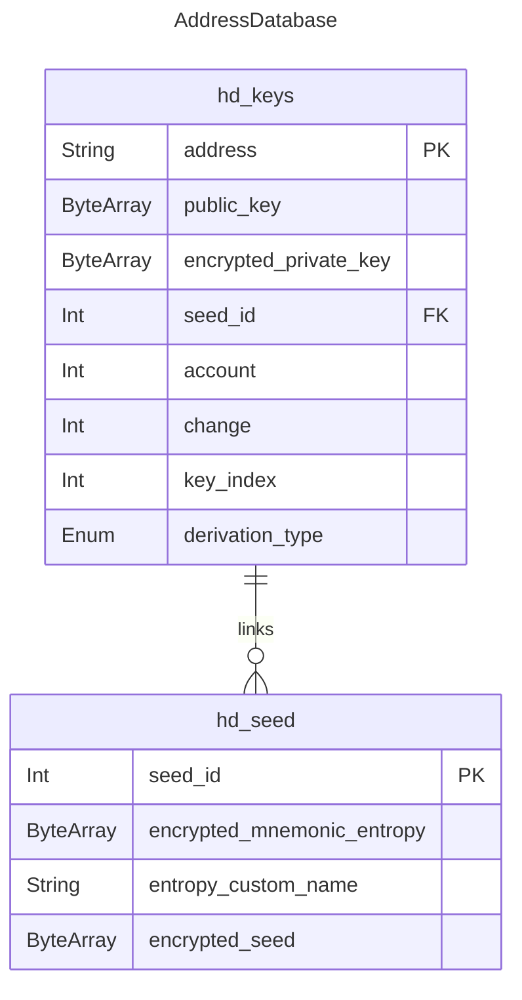
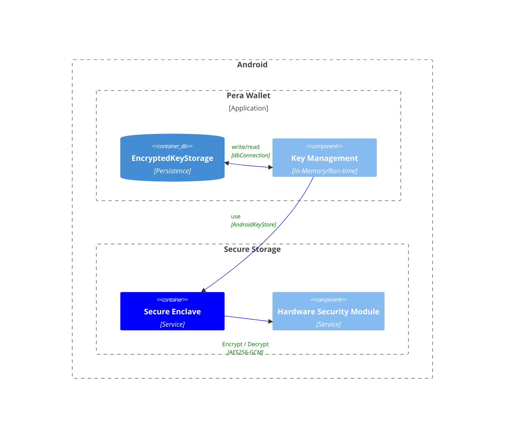

# Secure Key Management for Self-Custody Wallet

## Principles

- **Sensisble information should be encrypted at rest**
- **ONLY** the necessary information for the operation should be decrypted and loaded into memory
- **Sensitive information should be cleared from memory as soon as possible**
    - In some environments, such as JVM, some trust needs to be placed on the garbage collector. Ideally, this could be minimized with a compartmentalized design, where the application & key management don't share the same memory space.
- **Compartmentalize** run-time enviroments of application vs key management. (e.g. separate processes, containers, etc). 
    - This is for a future iteration
    - Dedicated design will be needed for this

## KMS Storage for xHDWallets

## Flows

### Importing Mnemonic

- User imports mnemonic
- With BIP39 lib, calculates entropy and seed
- Store seed and entropy in `hd_seed` table
- Clear from memory

#### BIP44 Address Scanning

- Apply BIP44 recovery algorithm to recover addresses
    - Reference: https://github.com/bitcoin/bips/blob/master/bip-0044.mediawiki#account-discovery
- Store addresses found in `hd_keys` table
- Use backend endpoint: `GET ...` to understand if an address has history or not

### Display or Verify Mnemonic
- Decrypt `encrypted_mnemonic_entropy` from hd_seed table
- Using BIP39; Convert it to mnemonic, display / verify
- Clear from memory

### Deriving new keys / addresses

- Decrypt `encrypted_seed` from hd_seed table
- Use `seed` with xHDWallets lib to derive keys
- Store keys in `hd_keys` table
- Clear `seed` from memory

### Signing with Keys / Addresses

To compartmentalize the risk of a compromised application or system, we want to avoid loading `seed` or `entropy` into memory. Instead, when we need to sign, only a single key is loaded into memory. This key is used to sign the transaction and we should attempt to clear it from memory as soon as possible.

- Load & Decrypt `encrypted_private_key` from `hd_keys` table
- Sign
- Clear

## Encryption

- Use AES256-GCM for encryption / decryption
- Use a symmetric key generated from the device's secure Enclave / HSM

